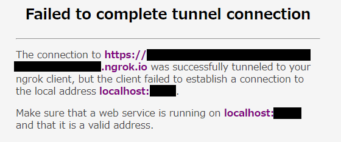

# 実行方法

このアプリには 3 種類の実行方法があります。

## production

実際にさくらの VPS で稼働させる時の実行方法です。

### production の導入方法

1. さくらの VPS へリポジトリを clone
2. ディレクトリ作成

   ```sh
   mkdir -p secrets/production
   ```

3. 以下のテキストファイルを作成し、中にパスワードなどの流出してはならない情報を保存
   - cookie_keys.txt
   - cookie_name.txt
   - database_url.txt
   - jwt_secret.txt
   - mongo_root_password.txt
   - mongo_root_username.txt
   - slack_client_id.txt
   - slack_client_secret.txt
   - slack_workspace_id.txt

### production の起動方法

```sh
bash production.sh up -d
```

### production の停止方法

```sh
bash production.sh down
```

## test

アプリの各機能が想定通り動くことを確認する単体テストを実行します。

### test の導入方法

1. さくらの VPS へリポジトリを clone
2. ディレクトリ作成

   ```sh
   mkdir -p secrets/test
   ```

3. 以下のテキストファイルを作成し、中にパスワードなどを保存
   - cookie_keys.txt
   - cookie_name.txt
   - database_url.txt
   - jwt_secret.txt
   - mongo_root_password.txt
   - mongo_root_username.txt
   - slack_client_id.txt
   - slack_client_secret.txt
   - slack_workspace_id.txt

### test の起動方法

```sh
bash test.sh up -d
```

### test の停止方法

```sh
bash test.sh down
```

## development

自分の PC で動作させるための実行方法です。新機能の追加やバグ修正など、アプリに変更を加える際にはこの production ではなく development で実行してください。

### development の導入方法

1. さくらの VPS へリポジトリを clone

   test で clone したものをそのまま使っても良い

2. ディレクトリ作成

   ```sh
   mkdir -p secrets/development
   ```

3. 以下のテキストファイルを作成し、中にパスワードなどを保存
   - cookie_keys.txt
   - cookie_name.txt
   - database_url.txt
   - jwt_secret.txt
   - mongo_root_password.txt
   - mongo_root_username.txt
   - slack_client_id.txt
   - slack_client_secret.txt
   - slack_workspace_id.txt
4. [ngrok](https://ngrok.com/)を導入
5. Slack App "AppNavi Works"にアクセスするための権限を、既に権限を持っている他の部員からもらう

### development の起動方法

1. ターミナル(コマンドプロンプト、Powershell など)を起動し、以下のコマンドを実行

   ```sh
   ngrok http 3000
   ```

   以下のようなメッセージが表示されるので、"https"から始まり".ngrok.io"で終わる URL(下のメッセージでは"https://xxxxxxx.ngrok.io")をコピーする。

   ```sh
   ngrok by @inconshreveable

   Session Status                online
   Account                       xxxxxxx (Plan: Free)
   Version                       2.3.40
   Region                        United States (us)
   Web Interface                 http://127.0.0.1:4040
   Forwarding                    http://xxxxxxx.ngrok.io -> http://localhost:3000
   Forwarding                    https://xxxxxxx.ngrok.io -> http://localhost:3000

   Connections                   ttl     opn     rt1     rt5     p50     p90
                                 0       0       0.00    0.00    0.00    0.00
   ```

   このコマンドは動き続けるが、アプリを終了する時まで停止させないこと。

   以降`https://xxxxxxx.ngrok.io`は先ほどコピーした URL に置き換えること。

   ここでhttps://xxxxxxx.ngrok.io にアクセスすると、画像のような画面が表示される。

   

   もし「偽のサイトにアクセスしようとしています」というような警告が表示されることがあるが、無視しても問題ない。気になる場合は、<kbd>Ctrl</kbd>+<kbd>C</kbd>を押して先ほどのコマンドを停止し、この手順をもう一度行う。

2. `.env`ファイルを作成し、以下の内容で保存

   ```.env
   SITE_URL_DEVELOPMENT="https://xxxxxxx.ngrok.io"
   ```

3. Slack App "AppNavi Works"の設定

   1. 設定ページにアクセスする
   2. `Features`の`OAuth & Permissions`をクリック
   3. `Redirect URLs`の`Add New Redirect URL`ボタンをクリック
   4. `Add New Redirect URL`ボタンの上にテキストボックスが表示されるので、以下の内容を入力して右の`Add`ボタンを押す("https://xxxxxxx.ngrok.io"は先ほどコピーしたURLに置き換える)

      ```txt
      https://xxxxxxx.ngrok.io/auth/redirect
      ```

   5. `Save URLs`ボタンをクリック

4. 新しいターミナルを起動し、コマンドを実行

   ```sh
   bash development.sh up -d
   ```

5. https://xxxxxxx.ngrok.io にアクセス("https://xxxxxxx.ngrok.io"は先ほどコピーしたURLに置き換える)

### development の停止方法

1. コマンド実行

   ```sh
   bash development.sh down
   ```

2. ngrok コマンドを実行しているターミナルを開き、<kbd>Ctrl</kbd>+<kbd>C</kbd>を押してコマンドを停止
3. Slack App "AppNavi Works"の設定
   1. 設定ページにアクセスする
   2. `Features`の`OAuth & Permissions`をクリック
   3. 起動時に追加した URL に右にあるゴミ箱アイコンをクリック
   4. `Save URLs`ボタンをクリック
